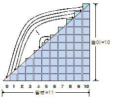
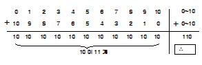

# a부터 b까지의 합

【문】 두 정수 a와 b에 대하여 a가 b보다 크다고 할 때, a와 b 사이에 있는 정수는 모두 몇 개인가?

【답】 a와 b를 포함하면 \[                \] 개

【문】 a에서 b까지의 모든 정수를 다 더하면 얼마인가? 예를 들어 0에서 10까지의 합은 55이다.

【답】 _쉽게 구할 수 없으므로 이제부터 방법을 찾아보자._


0에서 10까지의 합은 다음과 같이 삼각형의 면적으로 생각할 수 있다.  



또는 다음과 같이 대수적으로 생각할 수도 있다.  



이를 일반화하면 0에서 n까지의 합은 다음과 같다. 기호 Σ는 시그마\(sigma\)로 읽고 합을 뜻한다. $$sum_{i=0} ^{n} i= {n(n+1)} over {2}$$ 

n/2는 높이의 평균이고, n+1은 더해야할 수의 개수와 같다.

【문】 위의 수식에서 0에서 n까지의 합이 xx.5처럼 소숫점 이하가 나올 수 있는가?

【답】 \[ 아니오 \]   왜 그런가?  \[ n과 n+1 둘중에 하나는 짝수 \]


그러면 a부터 b까지의 합은 얼마일까? 답은 다음과 같다.

.... &lt;수식&gt; ....

예를 들어 17에서 36까지의 합은 \[ \(17+36\)×\(36-17+1\)/2 \] 이므로 답은 \[ 530 \] 이다.

【문】 7123456에서 7654321까지의 합은 얼마인가?

【답】 \[  일단은 "모르겠다"로 답한다. \]

위와 같은 질문에 대한 답을 직접 계산하는 것은 귀찮은 일이다. 이럴 때 신속․&lt;가운데 점&gt;정확한 컴퓨터를 이용하면 편리하다. 주어진 문제는 다음과 같다.


```
두 정수 a와 b를 입력받아 a에서 b까지의 합을 계산하여 출력하시오.
```



 Super-powers are granted randomly so please submit an issue if you're not happy with yours.


Once you're strong enough, save the world:


```bash
# Ain't no code for that yet, sorry
echo 'You got to trust me on this, I saved the world'
```



